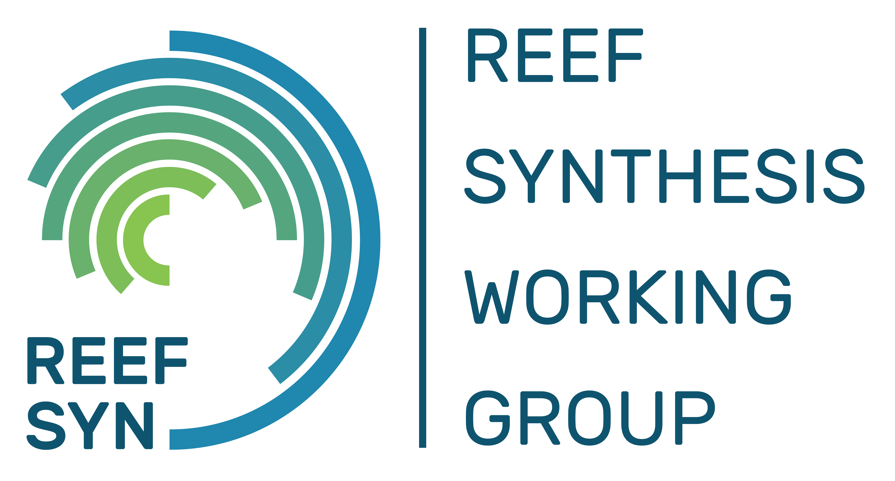

```{r setup, include=FALSE}
knitr::opts_chunk$set(echo = TRUE)
```


<!-- README.md is generated from README.Rmd. Please edit that file -->

<!-- badges: start -->
<!-- badges: end -->


```{r include=T,echo=F, warning=F, fig.align='center', out.width="60%",out.height="60%"}
# All defaults



```


##### Fontes de dados e decisões analíticas relevantes para a produção deste documento podem ser encontradas na nossa página https://sinbiose-reefs.github.io/ 

##### *Data sources and important analytical decisions made to produce this document can be found in our website* https://sinbiose-reefs.github.io/

##### Mais informações sobre nosso time podem ser encontradas na página do Laboratório de Macroecologia e Conservação Marinha (LMCM) at https://benderlab.weebly.com/ e na página do Grupo de Síntese de Ecossistemas Recifais (ReefSYN) em https://reefsyn.weebly.com/home-us.html

##### *Further information about our team can be found in the website of the Marine Macroecology and Conservation Lab at* https://benderlab.weebly.com/ *and the Reef Synthesis Working Group (ReefSYN) website* at https://reefsyn.weebly.com/home-us.html


<!-- badges: start -->
<!-- badges: end -->


##### O resumo foi produzido utilizando o seguinte software e pacotes / *This policy brief was produced using the following software and associated packages*:

```{r pressure, echo=F,warning=F,message=F}


source("R/packages.R")
sessionInfo()


```

